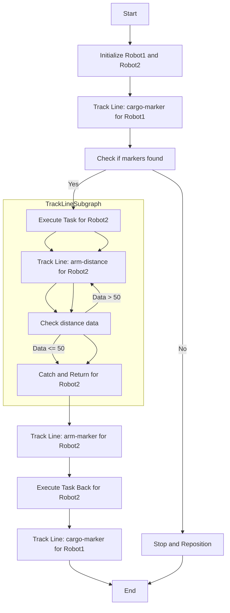

# Robot Line Tracking and Task Execution

This project involves controlling two robots to perform a series of tasks including line tracking, marker detection, distance measurement, and object manipulation. The robots use computer vision and various sensors to navigate and execute predefined tasks.

## Requirements

- Python 3.x
- OpenCV
- RoboMaster SDK
- NumPy

## Installation

1. Clone this repository:
    ```bash
    git clone <repository_url>
    cd <repository_directory>
    ```

2. Install the required packages:
    ```bash
    pip install opencv-python-headless robomaster numpy
    ```

## Usage

To run the program, execute the following command:
```bash
python main.py
```

## Overview

The program initializes two robots and executes a series of tasks involving line tracking, marker detection, and object manipulation. Below is a detailed explanation of the program flow.

## Program Flow

1. **Initialization:**
   - Initialize Robot1 and Robot2 with their respective serial numbers.

2. **Line Tracking (Robot1):**
   - Robot1 starts tracking a line in "cargo-marker" mode.

3. **Marker Detection:**
   - If markers are detected, Robot2 is tasked to execute the detected task.
   - If no markers are detected, the robots stop and reposition.

4. **Distance Measurement (Robot2):**
   - Robot2 tracks a line in "arm-distance" mode and measures the distance using sensors.

5. **Distance Data Check:**
   - If the distance data is less than or equal to 50, Robot2 executes a catch and return operation.
   - If the distance data is greater than 50, Robot2 continues tracking the line.

6. **Line Tracking (Robot2):**
   - Robot2 tracks a line in "arm-marker" mode to return to the specified location.

7. **Task Execution Back (Robot2):**
   - Robot2 executes the task to return the object to the starting position.

8. **Final Line Tracking (Robot1):**
   - Robot1 tracks the line in "cargo-marker" mode again to complete the cycle.

## Flowchart



## Classes and Functions

### Classes

#### MarkerInfo

This class stores information about detected markers.

- **Attributes:**
  - `x`, `y`: Coordinates of the marker.
  - `w`, `h`: Width and height of the marker.
  - `info`: Additional information about the marker.

- **Properties:**
  - `pt1`: Returns the top-left point of the marker.
  - `pt2`: Returns the bottom-right point of the marker.
  - `center`: Returns the center point of the marker.

#### PointInfo

This class stores information about detected points in the line.

- **Attributes:**
  - `x`, `y`: Coordinates of the point.
  - `theta`: Angle of the point.
  - `c`: Color code of the point.

- **Properties:**
  - `pt`: Returns the coordinates of the point.
  - `color`: Returns the color of the point.

#### PIDController

This class implements a PID controller for line tracking.

- **Attributes:**
  - `Kp`, `Ki`, `Kd`: PID coefficients.
  - `prev_error`: Previous error value.
  - `integral`: Integral of the error.

- **Methods:**
  - `compute(setpoint, current_value)`: Computes the control signal based on the setpoint and current value.

### Functions

- #### on_detect_marker(marker_info)

    Callback function to handle detected markers. It appends detected markers to the global `markers` list.

- #### on_detect_line(line_info)

    Callback function to handle detected lines. It updates the global `line_list` with detected line points.

- #### sub_data_distance(sub_info)

    Callback function to handle distance data. It updates the global `distance_data` with the measured distance.

- #### configure_robot(ep_robot)

    Configures the robot's components (vision, camera, chassis, gripper, sensor, gimbal) and returns them.

- #### track_line(ep_robot, mode)

    Tracks a line and executes tasks based on the specified mode ("cargo-marker", "arm-distance", or "arm-marker").

- #### configure_marker_execute(ep_vision, ep_chassis, ep_camera, ep_gimbal, mode)

    Configures the robot for marker-based execution. It handles line tracking, marker detection, and repositioning.

- #### configure_distance_execute(ep_vision, ep_chassis, ep_camera, ep_gimbal, ep_gripper, ep_sensor)

    Configures the robot for distance-based execution. It handles line tracking, distance measurement, and repositioning.

- #### process_lines_cargo(ep_chassis, img, pid, x_val, frame_width, line_list)

    Processes line data for cargo mode. It computes control signals using the PID controller and adjusts the robot's chassis speed.

- #### process_lines_arm(ep_chassis, ep_gimbal, img, pid, x_val, frame_width, line_list)

    Processes line data for arm mode. It computes control signals using the PID controller and adjusts both the robot's chassis and gimbal speed.

- #### stop_and_reposition(ep_chassis)

    Stops the robot and repositions it.

- #### execute_task(robot, task)

    Executes a specified task using the robot. The tasks involve rotating the chassis and moving the servo.

- #### catch_and_return(robot)

    Executes the catch and return operation. The robot grips an object, moves it, and returns to the starting position.

- #### execute_task_back(robot, task)

    Executes the task to return the object. It involves moving the chassis, servo, and gripper to release the object and return.

## Error Handling

The program includes error handling to ensure that the robots stop and reposition in case of any errors during execution.

## Conclusion

This project demonstrates the use of computer vision and robotic control to perform complex tasks involving line tracking and object manipulation. The use of a PID controller ensures precise control of the robots' movements.

For any issues or contributions, please feel free to open an issue or submit a pull request.

## License

This project is licensed under the MIT License. See the LICENSE file for details.
